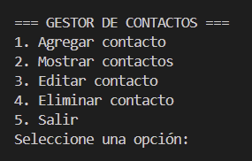
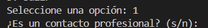
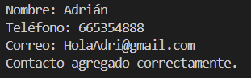
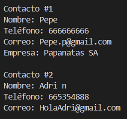
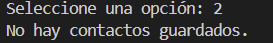
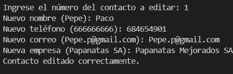
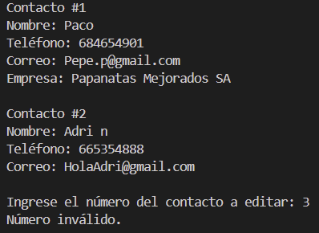
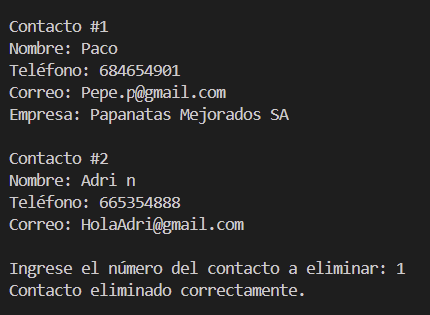
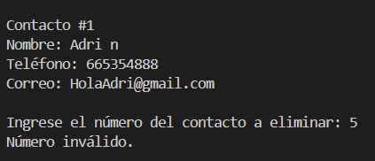
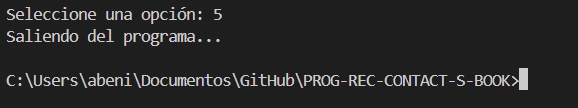

# PROG-REC-CONTACT-S-BOOK

MANUAL DE USUARIO

Al iniciar el programa pregunta cual de las operaciones CRUD querrás realizar.

1. Si eliges agregar contacto te preguntará si quieres crear un contacto profesinal.

Al introducir 's' comenzará a preguntar la información relevante al contacto con la adición de un campo llamado empresa.

En caso de optar por no crear un contacto profesional simplemente se omite la introducción de ese campo

2. Si eliges la opción de mostrar contactos se visualizarán por consola todos los contactos existentes actualmente.

En caso de no haber contactos se te mostrará un mensaje indicando que no hay contactos en este momento.

3. Si decides modificar un contacto se te preguntará por el número de índice del contacto a editar.
Entre paréntesis te saldrá el valor actual de cada campo.

En caso de no existir el número de contacto elegido se te hará saber

4. Al igual que con la opción anterior si se decide eleminar un contacto se te preguntará por su número de índice.

Si no existe se te hace saber.

5. Por último si le das a salir el programa finaliza. Te en cuenta que todos los contactos guardados no se matendrán cuando vuelvas a usar el programa

